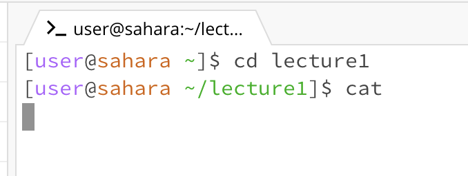
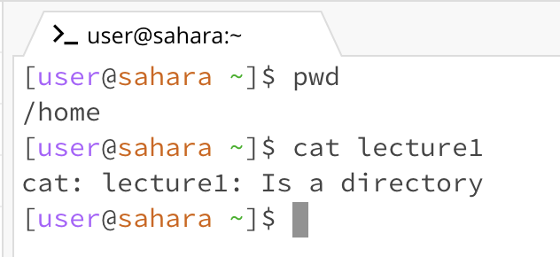

## Lab Report 1

**cd**

1.   

The working directory when the command was run was /home/lecture1/messages . The output was the working directory was set to home, because no argument was indicated for cd. Nothing was printed. The output is not an error. 

2.   

The working directory when the command was run was /home . The output of the command cd with a path to a directory, cd lecture1/messages was that the working directory was changed to the directory passed in as an argument, in this case, to the messages directory, nothing was printed. The output is not an error. 

3.   

The working directory when the command was run was /home . The output of the command cd lecture1/messages/en-us.txt , the path to a file, was a bash message indicating the argument passed in was not a directory. This output is an error because cd changes the current working directory, it cannot change to a file. 

**ls**
1.   

The working directory when the command was run was the home directory.
The output of the command ls with no args was lecture1 in bold blue. This is the output because the directories and/or files located within the home directory are lecture1. There is no error.

2.   

The working directory when the command was run was the lecture1 directory. The output of this command ls lecture1 was the files and directories within the lecture1 directory, the Hello.class, Hello.java, messages in a bold blue, and README. There is no error.

3.   

The working directory when the command was run was the home directory. The output of the command ls lecture1/messages/en-us.txt was nothing because we were already located within a file, and files are the lowest in the unix hierarchy, meaning files are not located within files. There is no error.

**cat**

1.    

 The working directory when the command was run was the lecture1 directory. The output of the command cat with no args was a blank line where the user can enter input, because the cat command allows one to create or view a file. There is no error. 

2.   

 The working directory when the command was run was the home directory. The resulting output of the command of cat lecture1 was an error stating that lecture1 is a directory. This is an error because cat takes in either a file to view or creates one, it does not work for directories. 

3.    

 The working directory when the command was run was the home directory. The resulting output of the command cat lecture1/messages/en-us.txt was viewing the contents of the file, so "Hello World!" was printed. There is no error.
