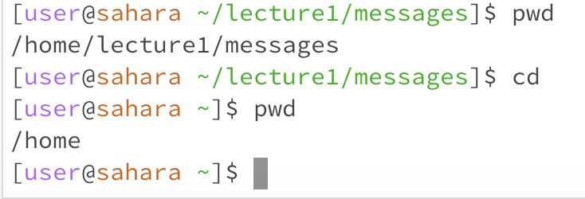
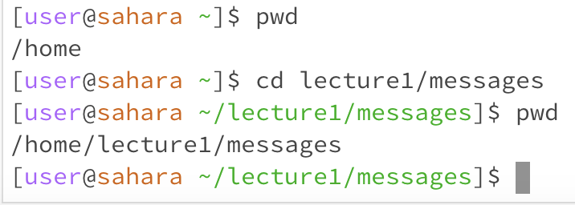
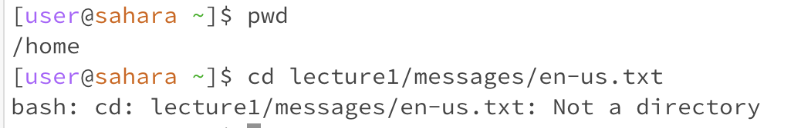
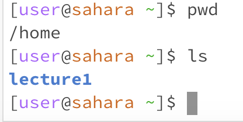
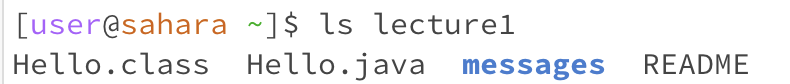
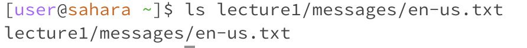

## Lab Report 1

**cd**
1.  The working directory when the command was run was /home/lecture1/messages . The output was the working directory was set to home, because no argument was indicated for cd. The output is not an error.
2.  The working directory when the command was run was /home . The output of the command with a path to a directory was that the working directory was changed to the directory passed in as an argument, in this case, to the messages directory. The output is not an error.
3.  The working directory when the command was run was /home . The output of the command with a path to a file was a bash message indicating the argument passed in was not a directory. This output is an error because cd changes the current working directory, it cannot change to a file.

**ls**
1.  The working directory when the command was run was the home directory. The output of the command was lecture1 in bold blue. This is the output because the directories and/or files located within the home directory are lecture1. There is no error.
2.  The working directory when the command was run was the lecture1 directory. The output of this command was the files and directories within the lecture1 directory, the Hello.class, Hello.java, messages , and README. There is no error.
3.  The working directory when the command was run was the home directory. The output of the command was nothing because we were already located within the file. There is no error.
