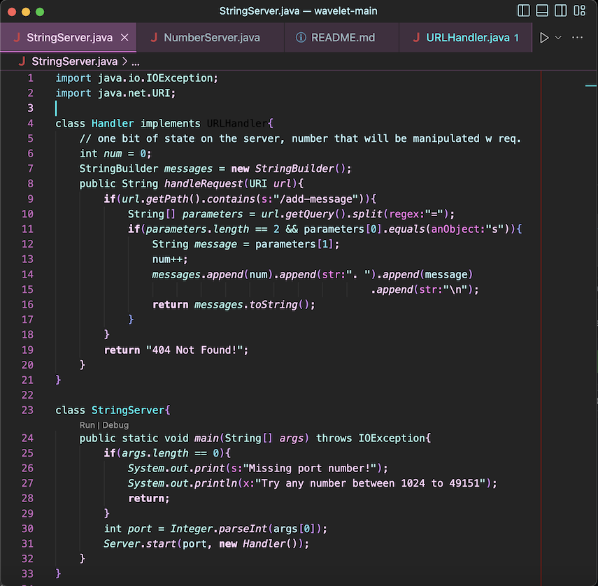

## Lab Report 2

**Part 1**  
StringServer.java code!  

1. Screenshot #1  
  
The method called in the '/add-message?s=' is the 'public String handleRequest(URI url)' . The relevant arguments here are the URL, which checks if it contains the 'add' String, and if it finds it, adds it as the String s to print out on the server. Initially, the value was null, so it printed "404 Not Found!" , when the '/add-message?s=hello' was added to the URL, the new URI became "http://localhost:4000/add-message?s=hello" , the String value 's' found by the '.getQuery()' call found "hello". Then, the value of the String[] parameters at 1 became the String s. The num value was increased to 1, which was printed and displayed as "1. " on the page, and then prints the new parameter[1], which was the new 's'. 
2. Screenshot #2  
  
The method called in the '/add-message?s=' is the 'public String handleRequest(URI url)' . The relevant arguments here are the URL, which checks if it contains the 'add' String, and if it finds it, adds it as the String s to print out on the server. Prior to this, the webpage had displayed " 1. hello \n 2. Greetings class \n " , when the `/add-message?s=CSE15L Fall 2023` was added to the URL, the new URI became "http://localhost:4000/add-message?s=CSE15L%20Fall%202023", the String value 's' found by the ".getQuery()" call found "CSE15L Fall 2023". Then, the value of the String[] parameters at 1 became the String s. The num value was increased to 3, which was printed and displayed as "3. " on the page, and then prints the new parameter[1], which was the new 's'.

**Part 2**  

The path to the private key for my SSH key from my home device:  
  
The path to the public key for my SSH key from my ieng6 account:  
  

Terminal action of logging in without being asked for a password:   

**Part 3**  

 Prior to labs week 2 and 3, I was unaware of how to connect to a remote server. I was absent during week 2 during sickness, but through reviewing the lab tasks and lectures, I learned about how to access and start up a server remotely through my cse15l account, how to add queries, and search for them, and to code a "simple search engine." Week 3 reinforced these learnings, especially with practice in using bash ssh to connect to my cse15l account, and the different commands used from the account as an access point (mkdir, scp). Adding to the code of the server URI taught me a lot too, like with the /add, /increment, and the meaning behind the '?q=' representing a query. 

