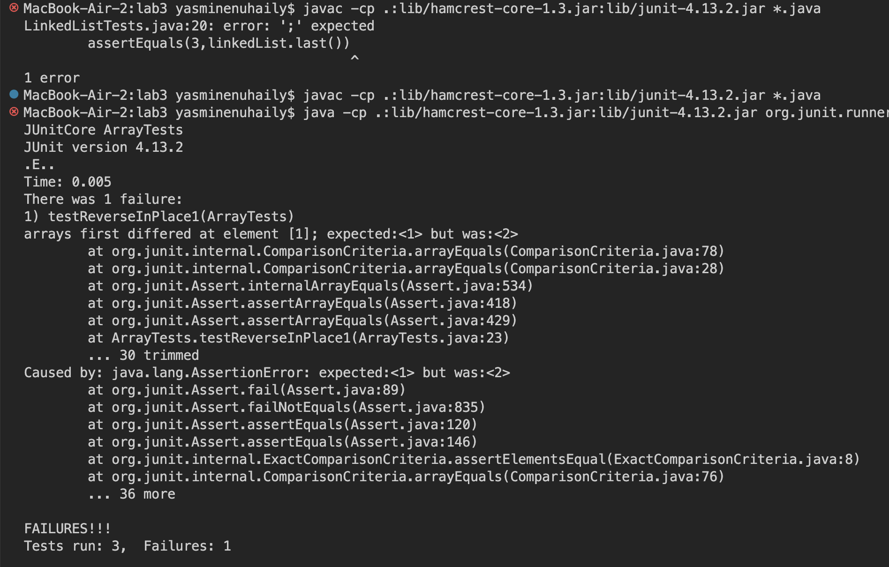

## Lab Report 3

**Part 1- Bugs** <br>
Chosen bug: `reverseInPlace` method. <br>
- A failure-inducing input for the buggy program: <br>
```
   @Test
   public void testReverseInPlace1()
   {
    int[] input1 = {1, 2};
    ArrayExamples.reverseInPlace(input1);
    assertArrayEquals(new int[]{2,1},input1);
   }
```
  - An input that doesn't induce a failure: <br>
  ```
   @Test
    public void testReverseInPlaceWorks()
    {
      int[] input1 = {1};
      ArrayExamples.reverseInPlace(input1);
      assertArrayEquals(new int[]{1},input1);
    }
  ```
  - Symptom on JUNIT of the tests: <br>
     <br>

  - Buggy Code Before:
```
     static void reverseInPlace(int[] arr) {
    for(int i = 0; i < arr.length; i += 1) {
      arr[i] = arr[arr.length - i - 1];
    }
  }
```
  - Code After:
    ```
    static void reverseInPlace(int[] arr) {
    for(int i = 0; i < arr.length/2; i += 1) {
      int temp = arr[i];
      arr[i] = arr[arr.length - i - 1];
      arr[arr.length-i-1] = temp;
    }
 <p> These fixes address the issue of the code by directly fixing the bugs. The original error in this code was that it did not store the value of `arr[i]` before modifying it, thus resulting in duplicate values of what was originally stored within `arr[arr.length-1-i]` , which is remedied with the assigning of a temp variable. Additionally, the code looped through the entirety of the array, causing it to, if the temp variable were now there, reverse the array back to its original order, hence the fix of only looping through `arr.length/2` . </p> <br>

**Part 2- Researching grep**
grep command:
`grep -c `: Found with terminal input `man grep` <br>
Example 1- <br>
```
MacBook-Air-2:911report yasminenuhaily$ grep -c "as" chapter-2.txt
250
```
Example 2- <br>
```
MacBook-Air-2:911report yasminenuhaily$ grep -c "hi" chapter-3.txt
592
```
` grep -i ` : Found with terminal input `man grep` <br>
Example 1-  <br>
```
MacBook-Air-2:docsearch yasminenuhaily$ grep -i "litigation" technical/government/About_LSC/LegalServCorp_v_VelazquezDissent.txt
activities," §2996f(b)(6), for "litigation relating to the
system," §2996f(b)(9), or for "litigation which seeks to procure a
entity that "participates in any . . . way . . . in litigation,
from participating on either side of litigation involving such
on litigation, however, is unique, and it contains a proviso
No. 99-603, p. 29. The litigation ban is symmetrical: Litigants
class of litigation, and under Rust that decision "does not
infringe the right" to bring such litigation. Cf. Ortwein v.
to waive filing fee for welfare benefits litigation). The Court's
organizations to conduct litigation and other activities that fall
litigation entirely. It is not the mandated, nondistortable
declining to subsidize the litigation unconstitutional under the
could not join its decision to conclude this litigation without
welfare-benefits litigation that Congress funded only under the
attorneys cannot engage in welfare litigation at all.
litigation); §504(a)(4) (local, state, and federal lobbying);
§504(a)(14) (litigation with respect to abortion). The severability
welfare litigation would have been accorded. As far as appears from
and litigation. But the proscriptions against using LSC funds to
limit on litigation. To remove that limit is to repeal subsection
proviso (prescribing only the general ban against "litigation,
to restrict publicly funded litigation of this sort. The Court says
judgment that awards the general litigation funding that the
```
Example 2- <br>
```
MacBook-Air-2:docsearch yasminenuhaily$ grep -i "hello" technical/911report/chapter-1.txt
    At 10:39, the Vice President updated the Secretary on the air threat conference: Vice President: There's been at least three instances here where we've had reports of aircraft approaching Washington-a couple were confirmed hijack. And, pursuant to the President's instructions I gave authorization for them to be taken out. Hello?
```
` grep -e `: Found with terminal input `man grep` <br> 
Example 1- <br>
```
MacBook-Air-2:911report yasminenuhaily$ grep -e "file" chapter-10.txt
                files and deportation of nonpermanent residents, forced al Qaeda to operate less
```
Example 2- <br>
```
MacBook-Air-2:911report yasminenuhaily$ grep -e "presidential" chapter-13.1.txt
                    parallel presidential advisory structure, the Homeland Security Council.
                now with other statutory presidential offices, like the U.S. trade representative.
                regarding the nomination of these directors, who are presidentially appointed. But
                Only presidential leadership can develop government-wide concepts and
```
`grep -F ` : Found with terminal input `man grep` <br>
Example 1- <br>
```
MacBook-Air-2:911report yasminenuhaily$ grep -F "foreign government" chapter-13.3.txt
            Two CIA memoranda of information from a foreign government report that the chief of
                "third hand," passed from the foreign government service that "does not meet
                U.S. government checked again with the foreign government to determine if there
```
Example 2- <br>
```
MacBook-Air-2:911report yasminenuhaily$ grep -F "United States" chapter-13.2.txt
                TSA-Transportation Security Administration; UAL-United Air Lines; USSS-United States
                the United States since 1991, sabotage was perceived as the most significant threat
                United States and Canada. According to the agreement in effect on 9/11, the "primary
                States." See DOS memo, Exchange of Notes Between Canada and the United States
```
