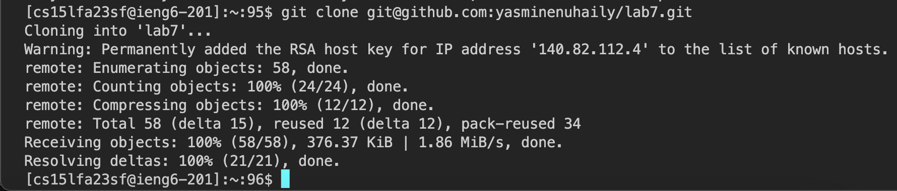
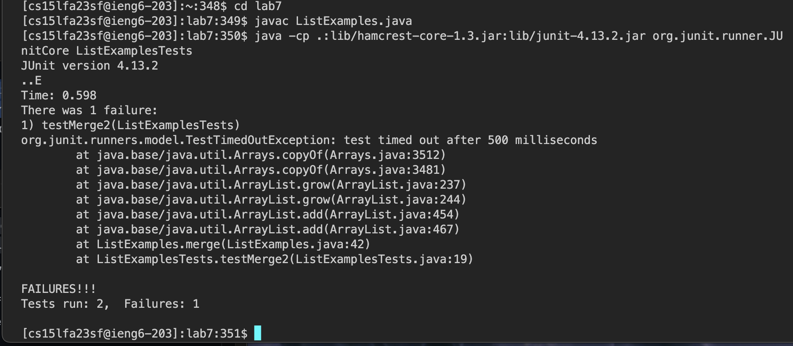

## Lab Report 4  

4.    Keys pressed: `ssh cse15lfa23sf@ieng6.ucsd.edu ` in order to log in to my ieng6 account.
5.    Keys pressed: `git clone git@github.com:yasminenuhaily/lab7.git` to clone the forked respository with the SSH URL.
6.    Keys pressed: `java -cp .:lib/hamcrest-core-1.3.jar:lib/junit-4.13.2.jar org.junit.runner.JUnitCore ListExamplesTests` to run the tests to show that they would fail.
7.    Keys pressed: ` <down><down><down><down><down><right><right> ` commands in order to move down through the code in order to get to the error of `index1` instead of `index2`, then, `<esc>, x` in order to verify first that `vim` was in normal mode, and then x to delete the character which my cursor was hovered over. `<left>` to get to the space right before I wanted to insert, and `2` to fix the code to become `index2` from the error that was prior `index1`. Next, `<esc>` to return to the normal `vim` mode, and `:wq` to save exit `vim`. Finally, `git add . ` to ensure all the changes would be taken into account, and `git commit -m "fixed"` to commit my changes to the main branch.
8.    Keys pressed: `<up> <up> <up> <up> <enter> ` The `java -cp .:lib/hamcrest-core-1.3.jar:lib/junit-4.13.2.jar org.junit.runner.JUnitCore ListExamplesTests` command was 4 up in the search history, so I used the up arrow inorder to access it and run the tests.
9.    Keys pressed: `git add .` to stage the changes to be commit, in this case all of them, then `git commit -m "fixed"` to commit the changes with the message "fixed". Finally, `git push` to push all of the changes into the repository.
