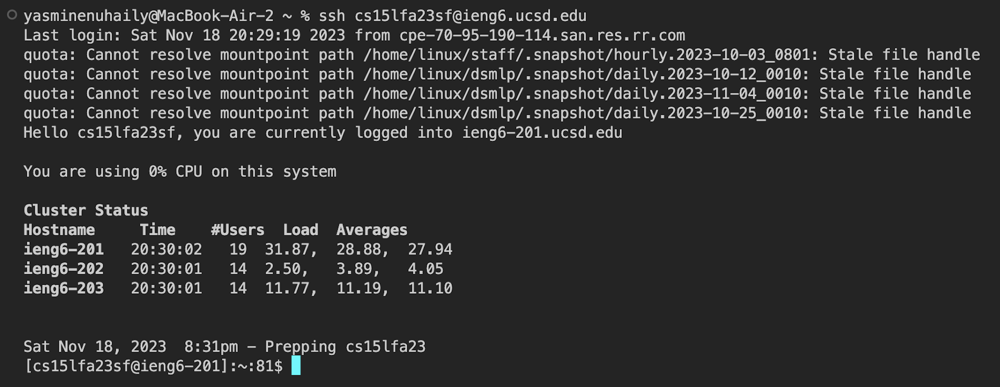
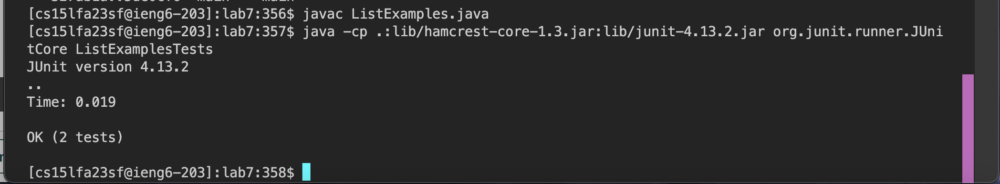

## Lab Report 4  

**Step 4**
   

Keys pressed: `ssh cs15lfa23sf@ieng6.ucsd.edu ` in order to log in to my ieng6 account.

**Step 5**
   

Keys pressed: `git clone ctrl+v <enter>` to clone the forked respository with the SSH URL that I had copied.

**Step 6**
   

Keys pressed: `javac ListExamples.java` to compile the code, then `ctrl+v <enter` in order to run `java -cp .:lib/hamcrest-core-1.3.jar:lib/junit-4.13.2.jar org.junit.runner.JUnitCore ListExamplesTests` as I had copied the path to run JUnit from `test.sh` to run the tests to show that they would fail.

**Step 7**
   
Keys pressed:  `<down><down><down><down><down><right><right>` commands in order to move down through the code in order to get to the error of `index1` instead of `index2`, then, `<esc>x` in order to first verify that `vim` was in normal mode, and then the `x` to delete the character which my cursor was hovered over. `<left>` to get to the space right before I wanted to insert, and `2` to fix the code to become `index2` from the error that was prior `index1`. Next, `<esc>:wq` to return to the normal `vim` mode, and the `:wq` to save exit `vim`.  
Fixed code:  
  
**Step 8**
   

Keys pressed: `<up><up><up><up><up><enter>` because the `javac ListExamples.java` was 5 up in the search history. Then, `<up><up><up><up><enter>` because the `java -cp .:lib/hamcrest-core-1.3.jar:lib/junit-4.13.2.jar org.junit.runner.JUnitCore ListExamplesTests` command was 4 up in the search history, so I used the up arrow in order to access it and run the tests to show they work successfully.

**Step 9**
  

Keys pressed: `git add .` to stage the all the changes to be commit, then `git commit -m "fixed"` to commit the changes with the message "fixed". Finally, `git push` to push all of the changes into the repository.
