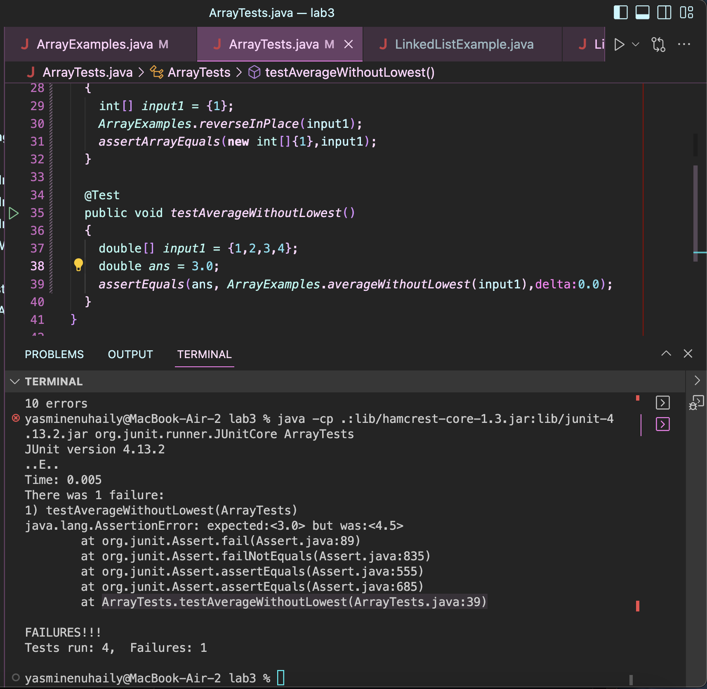
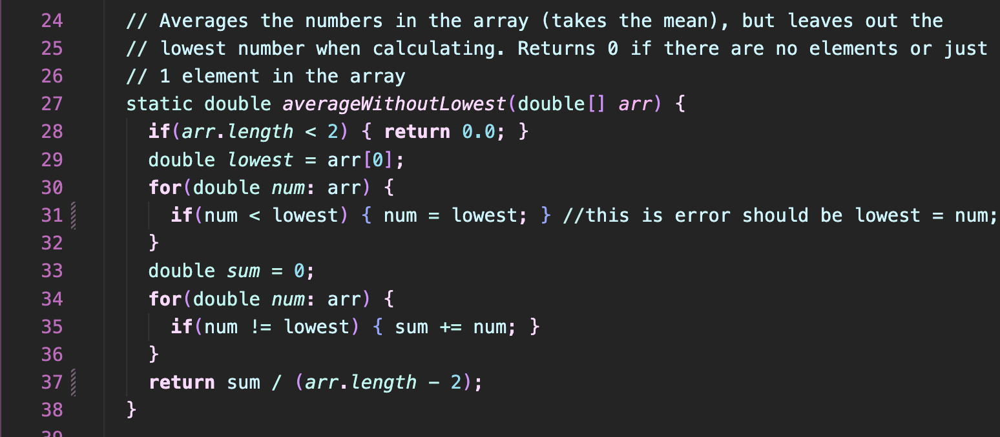

## Lab Report 5  

**Part 1**  
*Anonymous Student:*
 
Hello, I am having an issue I can't quite figure out in the lab 3 code with my `testAverageWithoutLowest()` test. My other tests all work for `ArrayExamples.java` I think it has to be with how I wrote the `averageWithoutLowestMethod()` but I can't find the error!
 
Here is my code to ArrayTests.java that and the output in the terminal with error.  
  

And here is my code to ArrayExamples.java
  

Thank you in advance!  

*TA Response*
 
Hello, It seems your error is in fact in your averageWithoutLowest() method! Try out different inputs of arrays and see what output you get. For example, if you make all but the smallest input the same value, what output is returned? Additionally, how many indices should there be when calculating the average for the output. I hope this helps. Let me know if you have any further questions.
