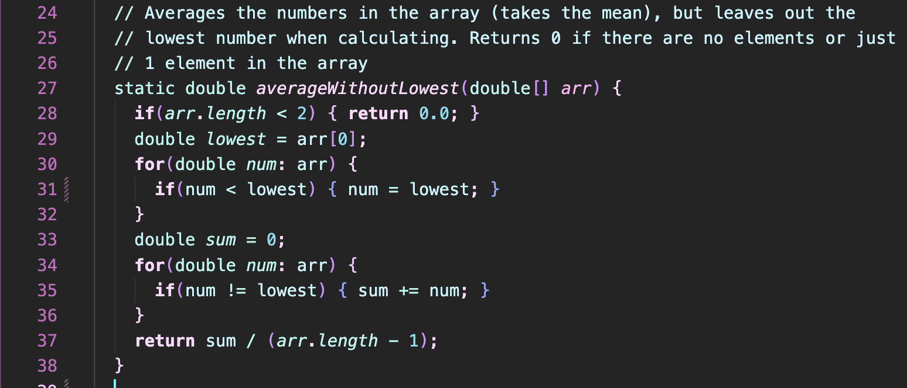

## Lab Report 5  

**Part 1**  
1. *Anonymous Student:*  
Hello, I am having an issue I can't quite figure out in the lab 3 code with my `testAverageWithoutLowest()` test. My other tests all work for `ArrayExamples.java` I think it has to be with how I wrote the `averageWithoutLowestMethod()` but I can't find the error!
Here is my code to ArrayTests.java that and the output in the terminal with error.  

  

And here is my code to ArrayExamples.java
  

Thank you in advance!  

2. *TA Response*  
Hello, It seems your error is in fact in your averageWithoutLowest() method! Try out different inputs of arrays and see what output you get. For example, if you make all but the input the same value, what output is returned? If you make the numbers farther apart, what output do you get? Additionally, what are you dividing by to get the average? I hope this helps. Let me know if you have any further questions.

3. Terminal Output from what was told to test:  
  
  
The bug from the code was that the code was setting `num = lowest`, as opposed to `lowest = num`, and when they were taking the average, they forgot to do `array.size()-2` instead of `-1`, because the lowest index is not included in taking the average. This thus caused an error that can't be seen if all the numbers input are the same, if the lowest number was in fact the first value, or if the average ended up being the same if divided bt `array.size()-1` when the lowest number is included!

4. The information needed for the setup was just the `ArrayExamples.java` file and the `ArrayTests.java` file in order to properly compile and run the code, and also to look for the errors. The lines ran to trigger the bug were just the output of what the average should be versus what the actual output was. To edit and fix the bug, setting line 31 in `ArrayExamples.java` to be `lowest = num` and line 37 to be return `sum / (arr.length - 2);`

**Part 2**  
For my lab experience throughout this quarter, I learned how to efficiently use the command line and even how to edit, add, commit, and push to git all from the command line. In particular, I enjoyed learning about the usage of Vim, as it made it so all the work can be done in one place. I think I definitely gained a lot from experience being physically in the labs, even though I had to miss quite a few due to sickness. The tutors were all very helpful and answered any and all the questions that I had, especially Justin! Big thank you to him for helping with all my little errors, including when the only error was being connected to the wrong WiFi!
